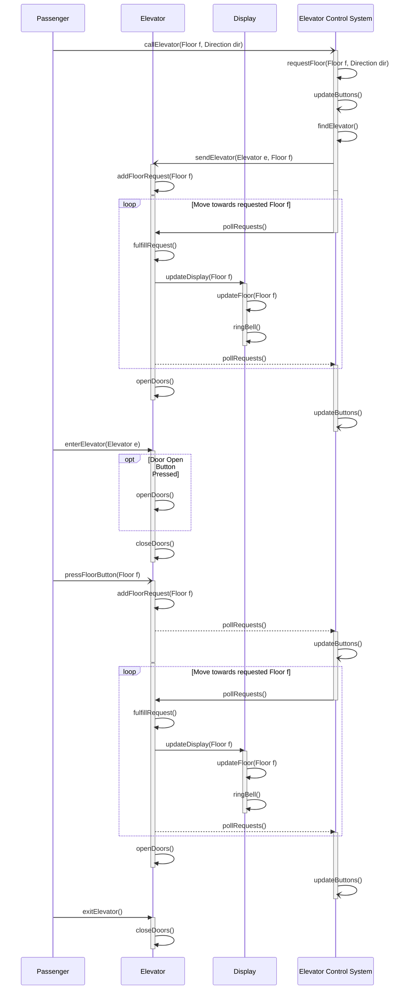

### **Success Scenario 1: ** Passenger requests elevator and rides it to floor *f* 

- Passenger calls the elevator from an arbitrary floor *f*, the ECS will find the nearest available elevator `findElevator()` and add floor *f* to that elevator's requests array `vector<Floor> requests`. The ECS will instruct the elevator to move through `pollRequests()`, continuously calling this method until the request is complete. Each time this method is called the elevator will move one floor. A request is completed when the elevator arrives at the floor of the request, at this point the doors will opens. Note that `pollRequests()` will return False until all requests are completed, `pollRequests()` triggers the elevator's `fulfillRequest()` method which causes the elevator to move towards the floors in `requests` array. 
- When the elevator reaches the floor of which the button was pressed from, the passenger enters and the door closes after 10 seconds. At this point in time the elevator and ECS are idle until further action is done.
- When the passenger presses a floor button to go to a different (or same) arbitrary floor *f*, that floor is added to the `requests` array, the ECS instructs the elevator to start moving with `pollRequests()` again until the elevator reaches the requested floor.
- This design allows for a robust system that encompasses different scenarios as well without altering the flow of the system. For example an edge case would what if a passenger calls the elevator and the elevator is already on that floor? Or alternatively the passenger enters on floor 1, the door closes and passenger presses floor 1? In this system, the floor is added to the `request` array as normal, the ECS will try fulfill that request. When the elevator sees its already at the destination floor then the request is deemed complete, at which the doors will then open.

