### **Success Scenario 2: ** Passenger *A* on 1st floor requests elevator to floor 4, at the same time Passenger *B* on 2nd floor requests elevator to go to floor 3.

- Note: This scenario builds off *Success Scenario 1*, please read description for that one first to have better understanding of how the system functions. 
- This scenario assumes both Passengers use the same elevator
- When Passenger *A* gets on the elevator and chooses to go to the 4th floor, that is added to the elevator's `requests` array. The ECS will then instruct the elevator to move floor by floor until it reaches the requested floor. `requests = [4]`
- During this time Passenger *B* calls the elevator from the 2nd floor. The ECS adds the second floor to the `requests` so now `requests = [2, 4]`.
- The elevator reaches the second floor so 2 is removed from the `requests` array as that floor request has now been fulfilled. `requests = [4]`
- When passenger three chooses to press the button to the third floor, that is also added to the requests array, so now `requests = [3, 4]`.
- Now the elevator ascends to the 3rd, then fourth floor fulfilling those two floor requests. 

```mermaid
sequenceDiagram

	participant passengerA#colon;Passenger()
	participant passengerB#colon;Passenger()
  participant Elevator
  participant Display
  participant Elevator Control System
  
  %% Passeneger A Requests elevator
	passengerA#colon;Passenger()-)Elevator Control System: callElevator(Floor f, Direction dir)
	activate Elevator Control System
	Elevator Control System->>Elevator Control System: requestFloor(Floor f, Direction dir)	
	Elevator Control System-)Elevator Control System: updateButtons()
	Elevator Control System->>Elevator Control System: findElevator()
	Elevator Control System-)Elevator: sendElevator(Elevator e, Floor f)
	activate Elevator
	Elevator->>Elevator: addFloorRequest(Floor f)
	deactivate Elevator Control System
	
	%% Move to floor f loop
	activate Elevator Control System
	deactivate Elevator
	activate Elevator
	loop Move towards requested Floor f
		Elevator Control System->>Elevator: pollRequests()
		deactivate Elevator Control System
    Elevator->>Elevator: fulfillRequest()
    Elevator->>Display: updateDisplay(Floor f)

    activate Display
    Display->>Display: updateFloor(Floor f)
    Display->>-Display: ringBell()
    Elevator-->>Elevator Control System: pollRequests()
    activate Elevator Control System
	end
	Elevator->>Elevator: openDoors()
	deactivate Elevator
	
	Elevator Control System-)Elevator Control System: updateButtons()
	deactivate Elevator Control System
	
	%% Passenger A enters when elevator arrives on first floor
	passengerA#colon;Passenger()->>Elevator: enterElevator(Elevator e)
	activate Elevator
	opt Door Open Button Pressed
		Elevator->>Elevator: openDoors()
	end
	Elevator->>Elevator: closeDoors()
	deactivate Elevator
	
	
	%% Passenger A requests floor
	passengerA#colon;Passenger()-)Elevator: pressFloorButton(Floor f)
	activate Elevator
	Elevator->>Elevator: addFloorRequest(Floor f)
	Elevator-->>Elevator Control System: pollRequest()
	
	activate Elevator Control System
	Elevator Control System-)Elevator Control System: updateButtons()
	deactivate Elevator Control System
	
	
	%% Passeneger B Requests elevator
	passengerB#colon;Passenger()-)Elevator Control System: callElevator(Floor f, Direction dir)

	activate Elevator Control System
	Elevator Control System->>Elevator Control System: requestFloor(Floor f, Direction dir)	
	Elevator Control System-)Elevator Control System: updateButtons()
	Elevator Control System->>Elevator Control System: findElevator()
	Elevator Control System-)Elevator: sendElevator(Elevator e, Floor f)

	Elevator->>Elevator: addFloorRequest(Floor f)
	deactivate Elevator Control System
	


	%% Move to floor f loop
	activate Elevator Control System
	deactivate Elevator
	activate Elevator
	loop Move towards requested Floor f
		Elevator Control System->>Elevator: pollRequests()
		deactivate Elevator Control System
    Elevator->>Elevator: fulfillRequest()
    Elevator->>Display: updateDisplay(Floor f)

    activate Display
    Display->>Display: updateFloor(Floor f)
    Display->>-Display: ringBell()
    Elevator-->>Elevator Control System: pollRequests()
    activate Elevator Control System
	end
	Elevator->>Elevator: openDoors()
	
	deactivate Elevator
	
	Elevator Control System-)Elevator Control System: updateButtons()
	deactivate Elevator Control System
	
	
	
	
	%% Passenger B enters
	passengerB#colon;Passenger()->>Elevator: enterElevator(Elevator e)
	activate Elevator
	opt Door Open Button Pressed
		Elevator->>Elevator: openDoors()
	end
	Elevator->>Elevator: closeDoors()
	deactivate Elevator
	
	%% Passenger B requests floor
	passengerB#colon;Passenger()-)Elevator: pressFloorButton(Floor f)
	activate Elevator
	Elevator->>Elevator: addFloorRequest(Floor f)
	Elevator-->>Elevator Control System: pollRequest()
	
	activate Elevator Control System
	Elevator Control System-)Elevator Control System: updateButtons()
	deactivate Elevator Control System
	
	
	
	
	
	%% Move to floor f loop
	activate Elevator Control System
	deactivate Elevator
	activate Elevator
	loop Move towards requested Floor f
		Elevator Control System->>Elevator: pollRequests()
		deactivate Elevator Control System
    Elevator->>Elevator: fulfillRequest()
    Elevator->>Display: updateDisplay(Floor f)

    activate Display
    Display->>Display: updateFloor(Floor f)
    Display->>-Display: ringBell()
    Elevator-->>Elevator Control System: pollRequests()
    activate Elevator Control System
	end
	Elevator->>Elevator: openDoors()
	
	deactivate Elevator
	
	Elevator Control System-)Elevator Control System: updateButtons()
	deactivate Elevator Control System
	
	
	passengerB#colon;Passenger()->>Elevator: exitElevator()
	activate Elevator
	Elevator->>Elevator: closeDoors()
	deactivate Elevator
	
	
		%% Move to floor f loop
	activate Elevator Control System
	activate Elevator
	loop Move towards requested Floor f
		Elevator Control System->>Elevator: pollRequests()
		deactivate Elevator Control System
    Elevator->>Elevator: fulfillRequest()
    Elevator->>Display: updateDisplay(Floor f)

    activate Display
    Display->>Display: updateFloor(Floor f)
    Display->>-Display: ringBell()
    Elevator-->>Elevator Control System: pollRequests()
    activate Elevator Control System
	end
	Elevator->>Elevator: openDoors()
	
	deactivate Elevator
	
	Elevator Control System-)Elevator Control System: updateButtons()
	deactivate Elevator Control System
	
	passengerA#colon;Passenger()->>Elevator: exitElevator()
	activate Elevator
	Elevator->>Elevator: closeDoors()
	deactivate Elevator
	
```

