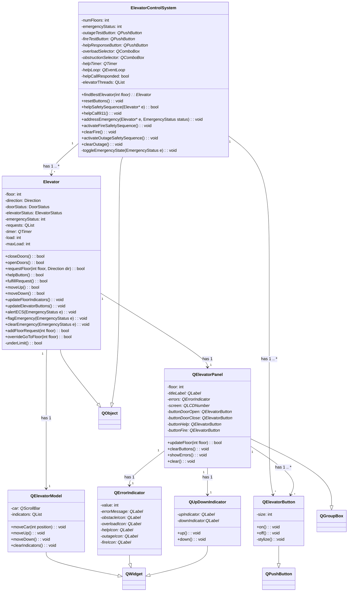

## UML Class Diagram

```mermaid
classDiagram
	ElevatorControlSystem "1" --> "*" Elevator: has 1 .. *
	ElevatorControlSystem "1" --> "*" QElevatorButton: has 1 .. *
	Elevator "1" --> "1" QElevatorPanel: has 1
	Elevator "1" --> "1" QElevatorModel: has 1
	QElevatorPanel "1" --> "1" QErrorIndicator: has 1
	QElevatorPanel "1" --> "1" QUpDownIndicator: has 1
	QElevatorPanel "1" --> "*" QElevatorButton: has 1 .. *
	Elevator --|> QObject
	ElevatorControlSystem --|> QObject
	QElevatorButton --|> QPushButton
	QElevatorModel --|> QWidget
	QElevatorPanel --|> QGroupBox
	QErrorIndicator --|> QWidget
	QUpDownIndicator --|> QWidget
	
	class Elevator{
	+closeDoors(): bool
+openDoors(): bool
+requestFloor(int floor, Direction dir): bool
+helpButton(): bool
+fulfillRequest(): bool
+moveUp(): bool
+moveDown(): bool
+updateFloorIndicators(): void
+updateElevatorButtons(): void
+alertECS(EmergencyStatus e): void
+flagEmergency(EmergencyStatus e): void
+clearEmergency(EmergencyStatus e): void
+addFloorRequest(int floor): bool
+overrideGoToFloor(int floor): bool
-floor: int
-direction: Direction
-doorStatus: DoorStatus
-elevatorStatus: ElevatorStatus
-emergencyStatus: int
-requests: QList<int>
-timer: QTimer*
-load: int
-maxLoad: int
-underLimit(): bool

	}
	
	class ElevatorControlSystem{
+findBestElevator(int floor): Elevator*
+resetButtons(): void
+helpSafetySequence(Elevator* e): bool
+helpCall911(): void
+addressEmergency(Elevator* e, EmergencyStatus status): void
+activateFireSafetySequence(): void
+clearFire(): void
+activateOutageSafetySequence(): void
+clearOutage(): void
-numFloors: int
-emergencyStatus: int
-outageTestButton: QPushButton*
-fireTestButton: QPushButton*
-helpResponseButton: QPushButton*
-overloadSelector: QComboBox*
-obstructionSelector: QComboBox*
-helpTimer: QTimer*
-helpLoop: QEventLoop*
-helpCallResponded: bool
-elevatorThreads: QList<QThread*>
-toggleEmergencyState(EmergencyStatus e): void
	}
	
class QElevatorButton{
	+on(): void
	+off(): void
	-size: int
	-stylize():void
}

class QElevatorModel{
+moveCar(int position): void
+moveUp(): void
+moveDown(): void
+clearIndicators(): void
-car: QScrollBar*
-indicators: QList<QLabel*>
}

class QElevatorPanel{
+updateFloor(int floor): bool
+clearButtons(): void
+showErrors(): void
+clear(): void
-floor: int
-titleLabel: QLabel*
-errors: QErrorIndicator*
-screen: QLCDNumber*
-buttonDoorOpen: QElevatorButton*
-buttonDoorClose: QElevatorButton*
-buttonHelp: QElevatorButton*
-buttonFire: QElevatorButton*
}

class QErrorIndicator{
-value: int
-errorMessage: QLabel*
-obstacleIcon: QLabel*
-overloadIcon: QLabel*
-helpIcon: QLabel*
-outageIcon: QLabel*
-fireIcon: QLabel*
}

class QUpDownIndicator{
+up(): void
+down(): void
-upIndicator: QLabel*
-downIndicator:QLabel*
}
```

