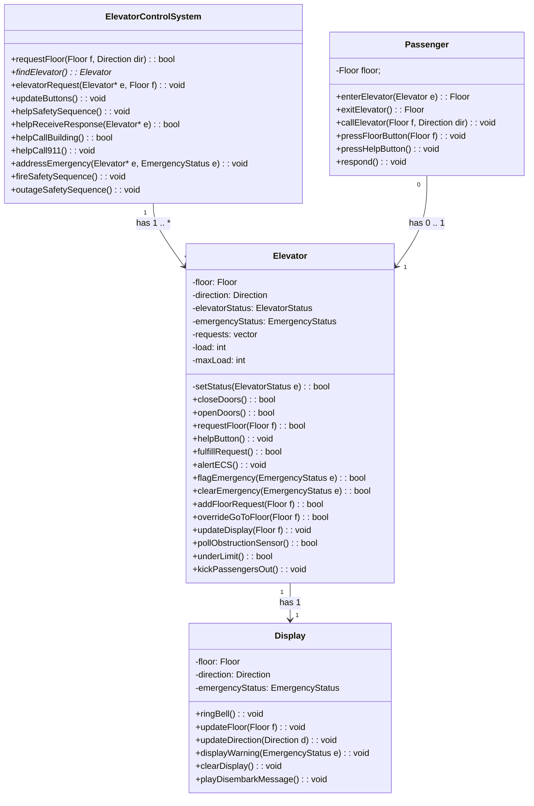

## UML Class Diagram

```mermaid
classDiagram
	ElevatorControlSystem "1" --> "*" Elevator: has 1 .. *
	Elevator "1" --> "1" Display: has 1
	Passenger "0" --> "1" Elevator: has 0 .. 1
	class Elevator{
		-floor: Floor
		-direction: Direction
		-elevatorStatus: ElevatorStatus
		-emergencyStatus: EmergencyStatus
		-requests: vector<Floor>
		-load: int
		-maxLoad: int
		-setStatus(ElevatorStatus e): bool
		+closeDoors(): bool
+openDoors(): bool
+requestFloor(Floor f): bool
+helpButton(): void
+fulfillRequest(): bool
+alertECS(): void
+flagEmergency(EmergencyStatus e): bool
+clearEmergency(EmergencyStatus e): bool
+addFloorRequest(Floor f): bool
+overrideGoToFloor(Floor f): bool
+updateDisplay(Floor f): void
+pollObstructionSensor(): bool
+underLimit(): bool
+kickPassengersOut(): void
	}
	
	class ElevatorControlSystem{
		+requestFloor(Floor f, Direction dir): bool 
+findElevator(): Elevator*
+elevatorRequest(Elevator* e, Floor f): void 
+updateButtons(): void 
+helpSafetySequence(): void 
+helpReceiveResponse(Elevator* e): bool 
+helpCallBuilding(): bool 
+helpCall911(): void 
+addressEmergency(Elevator* e, EmergencyStatus e): void 
+fireSafetySequence(): void 
+outageSafetySequence(): void 
	}
	
	class Display{
		-floor: Floor
		-direction: Direction
		-emergencyStatus: EmergencyStatus
		+ringBell(): void
		+updateFloor(Floor f): void
		+updateDirection(Direction d): void
		+displayWarning(EmergencyStatus e): void
		+clearDisplay(): void
		+playDisembarkMessage(): void
	}
	
	class Passenger{
		-Floor floor;
		+enterElevator(Elevator e): Floor
    +exitElevator(): Floor
    +callElevator(Floor f, Direction dir): void
    +pressFloorButton(Floor f): void
    +pressHelpButton(): void
    +respond(): void
	}
```

