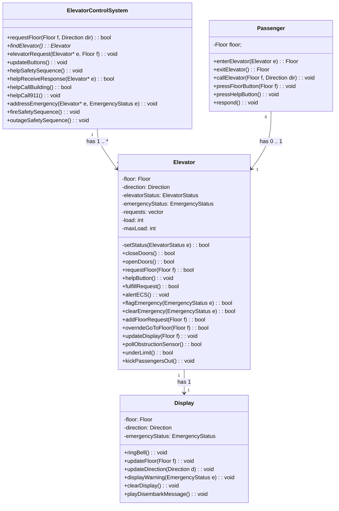
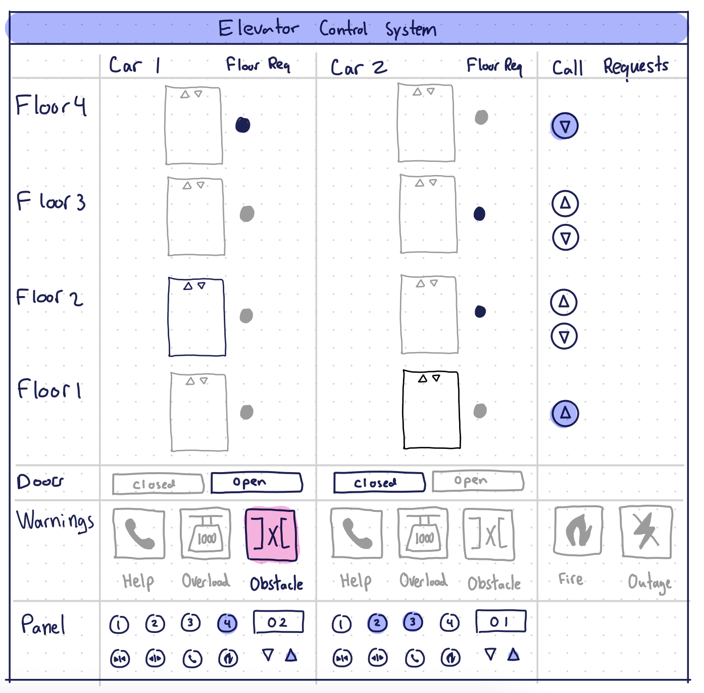
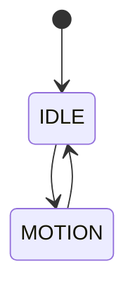

# COMP 3004 Assignment 2

```
Name: Abdullah Mostafa
Student Number: 101008311
Date: Oct 15, 2023
```


## Table of Contents

[TOC]


## UML Class Diagram



<hr>

## Traceability Matrix

| Id   | Requirement                                                  | Related Use Case                    | Fullfilled By                                   | Description                                                  |
| ---- | ------------------------------------------------------------ | ----------------------------------- | ----------------------------------------------- | ------------------------------------------------------------ |
| 01   | Elevator responds to external floor buttons                  | Passenger uses elevator             | `ElevatorControlSystem::elevatorRequest()`      | Allows the elevator to respond to external floor buttons     |
| 02   | Elevator responds to internal floor buttons                  | Passenger uses elevator             | `Elevator::addFloorRequest()`                   | Allows the elevator to respond to floor buttons in the elevator |
| 03   | Elevator moves between floors                                | Passenger uses elevator             | `Elevator::fulfillRequest()`                    | This ensures the elevator car can move between one floor to another by handling the requests |
| 04   | Elevator can open its doors                                  | Passenger uses elevator             | `Elevator::openDoors()`                         | Ensures elevator can open its doors                          |
| 05   | Elevator can close its doors                                 | Passenger uses elevator             | `Elevator::closeDoors()`                        | Ensures elevator can close its doors                         |
| 06   | Elevator goes to ground floor during fire alarm              | Fire alarm from building            | `ElevatorControlSystem::fireSafetySequence()`   | Allows for proper safety protocol during a fire alarm        |
| 07   | Elevator goes to ground floor during power outage            | Power outage in the building        | `ElevatorControlSystem::outageSafetySequence()` | Allows for proper safety protocol during a fire outage       |
| 08   | Help button triggers emergency response                      | Control system receives Help signal | `ElevatorControlSystem::helpSafetySequence()`   | Allows the system to respond to help calls                   |
| 09   | Door obstacle prevents door from closing                     | Door obstacle detected              | `Elevator::pollObstructionSensor()`             | Ensures doors don't close when there is something obstructing the door from closing |
| 10   | Overload limit in elevator                                   | Overload detected                   | `Elevator::underLimit()`                        | Ensures the elevator doesn't move when it surpasses the load limit |
| 11   | Update display floor number                                  | Many                                | `Elevator::updateDisplay()`                     | Ensures the elevator's display shows the according floor number |
| 12   | Show warnings on the display                                 | many                                | `Display::displayWarning()`                     | Ensures elevator's display shows the appropriate warning to the car passengers |
| 13   | Play disembark message                                       | many                                | `Display::playDisembarkMessage()`               | Allows the elevator to ask passengers to disembark during emergency situations |
| 14   | Ring bell                                                    | many                                | `Display::ringBell()`                           | Allows the elevator to ring a bell upon floor arrival        |
| 15   | Illuminate floor buttons when pressed                        | Passenger uses elevator             | `ElevatorControlSystem::updateButtons()`        | Allows for the system to indicate the request has been put in |
| 16   | Turn off Illuminated floor buttons when request is fulfilled | Passenger uses elevator             | `ElevatorControlSystem::updateButtons()`        | Allows for the system to clear fulfilled requests            |


<hr>
## Design Patterns Used

Throughout the design of the Elevator controller simulator's a couple  different design patterns were used to make the design more robust and organized.

The `ElevatorControlSystem` (ECS) is implemented as a Singleton Pattern, there is exactly one instance of the ECS class. This allows for a single point of control for all the elevators.

The way the elevators are controlled follows an Observer Pattern and a Command Pattern design. The ECS observes all the states of the different elevators, sensors, buttons etc and then commands each entity on the next instruction.

<hr>

## Use Case for Elevator Control System

**Use case: Using an Elevator**  

<u>**Primary Actor**</u>: Passenger 

<u>**Scope**</u>: Elevator control system

<u>**Level**</u>: User goal

<u>**Stakeholders and interests**</u>:

- <u>Passenger</u>: Wants to ride the elevator to a different floor 
- <u>Control System</u>: Responds to the elevator requests and overlooks safety systems
- <u>Building management</u>: Ensures the elevator operates safely and handles emergencies if they were to occur
- <u>Safety service</u>: Provides help in emergency situations

<u>**Pre-conditions**</u>: 

- The elevator is operational

<u>**Post-conditions**</u>: 

- The elevator arrives at the floor that the passenger requested

<u>**Minimal Guarantees**</u>: 

<u>**Success Guarantees**</u>:

<u>**Trigger**</u>: The passenger calls the elevator with the Up/Down button on the floor they want to move away from

<u>**Main Success Scenario**</u>:

1. The passenger presses Up/Down button on the floor to request the elevator

    ​	a. The pressed button illuminates

    ​	b. A request signal is sent to the control system to bring the car down to that floor

2. The elevator starts moving to the requested floor if it is not already there

    ​	a. The bell rings when the elevator car arrives

    ​	b. The floor indicator on the screen updates to the current floor

    ​	c. The elevator announces what floor it is on

    ​	d. The up/down button light on the floor to request the elevator turns off

    ​	e. The doors on the elevator's car opens and remains open for 10 seconds

3. The passenger enters the elevator

    ​	a. The passenger presses the floor they want to go to 

    ​	b. The light on the pressed floor illuminates

    ​	c.  The bell rings and the doors close

4. The elevator moves to the requested floor

    ​	a. The bell rings when the elevator car arrives

    ​	b. The floor indicator on the screen updates to the current floor

    ​	c. The elevator announces what floor it is on

    ​	d. The floor button light that was pressed turns off

    ​	e. The doors on the elevator's car opens and remains open for 10 seconds

5. The passenger exits on the floor they wanted to go to

<u>**Extensions**</u>:

6. Help button is pressed

    ​	a. Control system receives a help request

    ​	b. Passenger is connected to the safety service through a voice connection

    ​	c. If no response from the passenger or safety service within 5 seconds, 911 is called

7. Door obstacle is detected 

    ​	a. An audible alert is played

    ​	b. The door is prevented from closing until the obstacle is clear from the door

8. Fire alarm was set off in the building or in the elevator

    ​	a.  The control system instructs the elevator to go to the nearest safest floor

    ​	b. The elevator plays a warning message and shows it on the screen

9. Overload is detected 

    ​	a. An audible alert is played and the screen updates

    ​	b. The door is prevented from closing until the overload sensor detects a safe load

10. Door open button is pressed

    ​	a. The doors remain open for another 10 seconds or until the button isn't being pressed anymore

11. Door close button is pressed

    ​	a. The doors attempt to close right away
    
    

<hr>
## Sequence Diagrams

### Success Scenario 1 

**Passenger requests elevator and rides it to floor f**

- Passenger calls the elevator from an arbitrary floor *f*, the ECS will find the nearest available elevator `findElevator()` and add floor *f* to that elevator's requests array `vector<Floor> requests`. The ECS will instruct the elevator to move through `pollRequests()`, continuously calling this method until the request is complete. Each time this method is called the elevator will move one floor. A request is completed when the elevator arrives at the floor of the request, at this point the doors will opens. Note that `pollRequests()` will return False until all requests are completed, `pollRequests()` triggers the elevator's `fulfillRequest()` method which causes the elevator to move towards the floors in `requests` array. 
- When the elevator reaches the floor of which the button was pressed from, the passenger enters and the door closes after 10 seconds. At this point in time the elevator and ECS are idle until further action is done.
- When the passenger presses a floor button to go to a different (or same) arbitrary floor *f*, that floor is added to the `requests` array, the ECS instructs the elevator to start moving with `pollRequests()` again until the elevator reaches the requested floor.
- This design allows for a robust system that encompasses different scenarios as well without altering the flow of the system. For example an edge case would what if a passenger calls the elevator and the elevator is already on that floor? Or alternatively the passenger enters on floor 1, the door closes and passenger presses floor 1? In this system, the floor is added to the `request` array as normal, the ECS will try fulfill that request. When the elevator sees its already at the destination floor then the request is deemed complete, at which the doors will then open.

```mermaid
sequenceDiagram

	participant passenger1#colon;Passenger()
  	participant elevator1#colon;Elevator()
  	participant display#colon;Display()
 	participant ecs#colon;ElevatorControlSystem()
  
  
	passenger1#colon;Passenger()-)ecs#colon;ElevatorControlSystem(): callElevator(Floor f, Direction dir)
	activate ecs#colon;ElevatorControlSystem()
	ecs#colon;ElevatorControlSystem()->>ecs#colon;ElevatorControlSystem(): requestFloor(Floor f, Direction dir)
	
	
	ecs#colon;ElevatorControlSystem()-)ecs#colon;ElevatorControlSystem(): updateButtons()
	ecs#colon;ElevatorControlSystem()->>ecs#colon;ElevatorControlSystem(): findElevator()
	ecs#colon;ElevatorControlSystem()-)elevator1#colon;Elevator(): sendElevator(Elevator e, Floor f)
	
	
	activate elevator1#colon;Elevator()
	elevator1#colon;Elevator()->>elevator1#colon;Elevator(): addFloorRequest(Floor f)
	deactivate ecs#colon;ElevatorControlSystem()
	
	%% Move to floor f loop
	activate ecs#colon;ElevatorControlSystem()
	deactivate elevator1#colon;Elevator()
	activate elevator1#colon;Elevator()
	loop Move towards requested Floor f
		ecs#colon;ElevatorControlSystem()->>elevator1#colon;Elevator(): pollRequests()
		deactivate ecs#colon;ElevatorControlSystem()
    elevator1#colon;Elevator()->>elevator1#colon;Elevator(): fulfillRequest()
    elevator1#colon;Elevator()->>display#colon;Display(): updatedisplay#colon;Display()(Floor f)

    activate display#colon;Display()
    display#colon;Display()->>display#colon;Display(): updateFloor(Floor f)
    display#colon;Display()->>-display#colon;Display(): ringBell()
    elevator1#colon;Elevator()-->>ecs#colon;ElevatorControlSystem(): pollRequests()
    activate ecs#colon;ElevatorControlSystem()
	end
	elevator1#colon;Elevator()->>elevator1#colon;Elevator(): openDoors()
	deactivate elevator1#colon;Elevator()
	
	ecs#colon;ElevatorControlSystem()-)ecs#colon;ElevatorControlSystem(): updateButtons()
	deactivate ecs#colon;ElevatorControlSystem()
	
	
	passenger1#colon;Passenger()->>elevator1#colon;Elevator(): enterElevator(Elevator e)
	activate elevator1#colon;Elevator()
	opt Door Open Button Pressed
		elevator1#colon;Elevator()->>elevator1#colon;Elevator(): openDoors()
	end
	elevator1#colon;Elevator()->>elevator1#colon;Elevator(): closeDoors()
	deactivate elevator1#colon;Elevator()
	
	
	passenger1#colon;Passenger()-)elevator1#colon;Elevator(): pressFloorButton(Floor f)
	activate elevator1#colon;Elevator()
	elevator1#colon;Elevator()->>elevator1#colon;Elevator(): addFloorRequest(Floor f)
	elevator1#colon;Elevator()-->>ecs#colon;ElevatorControlSystem(): pollRequests()
	
	


	%% Move to floor f loop
	activate ecs#colon;ElevatorControlSystem()
	ecs#colon;ElevatorControlSystem()-)ecs#colon;ElevatorControlSystem(): updateButtons()
	deactivate elevator1#colon;Elevator()
	activate elevator1#colon;Elevator()
	loop Move towards requested Floor f
		ecs#colon;ElevatorControlSystem()->>elevator1#colon;Elevator(): pollRequests()
		deactivate ecs#colon;ElevatorControlSystem()
    elevator1#colon;Elevator()->>elevator1#colon;Elevator(): fulfillRequest()
    elevator1#colon;Elevator()->>display#colon;Display(): updatedisplay#colon;Display()(Floor f)

    activate display#colon;Display()
    display#colon;Display()->>display#colon;Display(): updateFloor(Floor f)
    display#colon;Display()->>-display#colon;Display(): ringBell()
    elevator1#colon;Elevator()-->>ecs#colon;ElevatorControlSystem(): pollRequests()
    activate ecs#colon;ElevatorControlSystem()
	end
	elevator1#colon;Elevator()->>elevator1#colon;Elevator(): openDoors()
	
	deactivate elevator1#colon;Elevator()
	
	ecs#colon;ElevatorControlSystem()-)ecs#colon;ElevatorControlSystem(): updateButtons()
	deactivate ecs#colon;ElevatorControlSystem()
	
	passenger1#colon;Passenger()->>elevator1#colon;Elevator(): exitElevator()
	activate elevator1#colon;Elevator()
	elevator1#colon;Elevator()->>elevator1#colon;Elevator(): closeDoors()
	deactivate elevator1#colon;Elevator()
	
```


<hr>

### Success Scenario 2

**Passenger A on 1st floor requests elevator to floor 4, at the same time Passenger B on 2nd floor requests elevator to go to floor 3.**

- Note: This scenario builds off *Success Scenario 1*, please read description for that one first to have better understanding of how the system functions. 
- This scenario assumes both Passengers use the same elevator
- When Passenger *A* gets on the elevator and chooses to go to the 4th floor, that is added to the elevator's `requests` array. The ECS will then instruct the elevator to move floor by floor until it reaches the requested floor. `requests = [4]`
- During this time Passenger *B* calls the elevator from the 2nd floor. The ECS adds the second floor to the `requests` so now `requests = [2, 4]`.
- The elevator reaches the second floor so 2 is removed from the `requests` array as that floor request has now been fulfilled. `requests = [4]`
- When passenger three chooses to press the button to the third floor, that is also added to the requests array, so now `requests = [3, 4]`.
- Now the elevator ascends to the 3rd, then fourth floor fulfilling those two floor requests. 

```mermaid
sequenceDiagram

	participant passengerA#colon;Passenger()
	participant passengerB#colon;Passenger()
  	participant elevator1#colon;Elevator()
  	participant display#colon;Display()
  	participant ecs#colon;ElevatorControlSystem()
  
  	%% Passeneger A Requests elevator1#colon;Elevator()
	passengerA#colon;Passenger()-)ecs#colon;ElevatorControlSystem(): callElevator(Floor f, Direction dir)
	activate ecs#colon;ElevatorControlSystem()
	ecs#colon;ElevatorControlSystem()->>ecs#colon;ElevatorControlSystem(): requestFloor(Floor f, Direction dir)	
	ecs#colon;ElevatorControlSystem()-)ecs#colon;ElevatorControlSystem(): updateButtons()
	ecs#colon;ElevatorControlSystem()->>ecs#colon;ElevatorControlSystem(): findElevator()
	ecs#colon;ElevatorControlSystem()-)elevator1#colon;Elevator(): sendElevator(Elevator e, Floor f)
	activate elevator1#colon;Elevator()
	elevator1#colon;Elevator()->>elevator1#colon;Elevator(): addFloorRequest(Floor f)
	deactivate ecs#colon;ElevatorControlSystem()
	
	%% Move to floor f loop
	activate ecs#colon;ElevatorControlSystem()
	deactivate elevator1#colon;Elevator()
	activate elevator1#colon;Elevator()
	loop Move towards requested Floor f
		ecs#colon;ElevatorControlSystem()->>elevator1#colon;Elevator(): pollRequests()
		deactivate ecs#colon;ElevatorControlSystem()
    elevator1#colon;Elevator()->>elevator1#colon;Elevator(): fulfillRequest()
    elevator1#colon;Elevator()->>display#colon;Display(): updatedisplay#colon;Display()(Floor f)

    activate display#colon;Display()
    display#colon;Display()->>display#colon;Display(): updateFloor(Floor f)
    display#colon;Display()->>-display#colon;Display(): ringBell()
    elevator1#colon;Elevator()-->>ecs#colon;ElevatorControlSystem(): pollRequests()
    activate ecs#colon;ElevatorControlSystem()
	end
	elevator1#colon;Elevator()->>elevator1#colon;Elevator(): openDoors()
	deactivate elevator1#colon;Elevator()
	
	ecs#colon;ElevatorControlSystem()-)ecs#colon;ElevatorControlSystem(): updateButtons()
	deactivate ecs#colon;ElevatorControlSystem()
	
	%% Passenger A enters when elevator arrives on first floor
	passengerA#colon;Passenger()->>elevator1#colon;Elevator(): enterElevator(Elevator e)
	activate elevator1#colon;Elevator()
	opt Door Open Button Pressed
		elevator1#colon;Elevator()->>elevator1#colon;Elevator(): openDoors()
	end
	elevator1#colon;Elevator()->>elevator1#colon;Elevator(): closeDoors()
	deactivate elevator1#colon;Elevator()
	
	
	%% Passenger A requests floor
	passengerA#colon;Passenger()-)elevator1#colon;Elevator(): pressFloorButton(Floor f)
	activate elevator1#colon;Elevator()
	elevator1#colon;Elevator()->>elevator1#colon;Elevator(): addFloorRequest(Floor f)
	elevator1#colon;Elevator()-->>ecs#colon;ElevatorControlSystem(): pollRequest()
	
	activate ecs#colon;ElevatorControlSystem()
	ecs#colon;ElevatorControlSystem()-)ecs#colon;ElevatorControlSystem(): updateButtons()
	deactivate ecs#colon;ElevatorControlSystem()
	
	
	%% Passeneger B Requests elevator1#colon;Elevator()
	passengerB#colon;Passenger()-)ecs#colon;ElevatorControlSystem(): callElevator(Floor f, Direction dir)

	activate ecs#colon;ElevatorControlSystem()
	ecs#colon;ElevatorControlSystem()->>ecs#colon;ElevatorControlSystem(): requestFloor(Floor f, Direction dir)	
	ecs#colon;ElevatorControlSystem()-)ecs#colon;ElevatorControlSystem(): updateButtons()
	ecs#colon;ElevatorControlSystem()->>ecs#colon;ElevatorControlSystem(): findElevator()
	ecs#colon;ElevatorControlSystem()-)elevator1#colon;Elevator(): sendElevator(Elevator e, Floor f)

	elevator1#colon;Elevator()->>elevator1#colon;Elevator(): addFloorRequest(Floor f)
	deactivate ecs#colon;ElevatorControlSystem()
	


	%% Move to floor f loop
	activate ecs#colon;ElevatorControlSystem()
	deactivate elevator1#colon;Elevator()
	activate elevator1#colon;Elevator()
	loop Move towards requested Floor f
		ecs#colon;ElevatorControlSystem()->>elevator1#colon;Elevator(): pollRequests()
		deactivate ecs#colon;ElevatorControlSystem()
    elevator1#colon;Elevator()->>elevator1#colon;Elevator(): fulfillRequest()
    elevator1#colon;Elevator()->>display#colon;Display(): updatedisplay#colon;Display()(Floor f)

    activate display#colon;Display()
    display#colon;Display()->>display#colon;Display(): updateFloor(Floor f)
    display#colon;Display()->>-display#colon;Display(): ringBell()
    elevator1#colon;Elevator()-->>ecs#colon;ElevatorControlSystem(): pollRequests()
    activate ecs#colon;ElevatorControlSystem()
	end
	elevator1#colon;Elevator()->>elevator1#colon;Elevator(): openDoors()
	
	deactivate elevator1#colon;Elevator()
	
	ecs#colon;ElevatorControlSystem()-)ecs#colon;ElevatorControlSystem(): updateButtons()
	deactivate ecs#colon;ElevatorControlSystem()
	
	
	
	
	%% Passenger B enters
	passengerB#colon;Passenger()->>elevator1#colon;Elevator(): enterElevator(Elevator e)
	activate elevator1#colon;Elevator()
	opt Door Open Button Pressed
		elevator1#colon;Elevator()->>elevator1#colon;Elevator(): openDoors()
	end
	elevator1#colon;Elevator()->>elevator1#colon;Elevator(): closeDoors()
	deactivate elevator1#colon;Elevator()
	
	%% Passenger B requests floor
	passengerB#colon;Passenger()-)elevator1#colon;Elevator(): pressFloorButton(Floor f)
	activate elevator1#colon;Elevator()
	elevator1#colon;Elevator()->>elevator1#colon;Elevator(): addFloorRequest(Floor f)
	elevator1#colon;Elevator()-->>ecs#colon;ElevatorControlSystem(): pollRequest()
	
	activate ecs#colon;ElevatorControlSystem()
	ecs#colon;ElevatorControlSystem()-)ecs#colon;ElevatorControlSystem(): updateButtons()
	deactivate ecs#colon;ElevatorControlSystem()
	
	
	
	
	
	%% Move to floor f loop
	activate ecs#colon;ElevatorControlSystem()
	deactivate elevator1#colon;Elevator()
	activate elevator1#colon;Elevator()
	loop Move towards requested Floor f
		ecs#colon;ElevatorControlSystem()->>elevator1#colon;Elevator(): pollRequests()
		deactivate ecs#colon;ElevatorControlSystem()
    elevator1#colon;Elevator()->>elevator1#colon;Elevator(): fulfillRequest()
    elevator1#colon;Elevator()->>display#colon;Display(): updatedisplay#colon;Display()(Floor f)

    activate display#colon;Display()
    display#colon;Display()->>display#colon;Display(): updateFloor(Floor f)
    display#colon;Display()->>-display#colon;Display(): ringBell()
    elevator1#colon;Elevator()-->>ecs#colon;ElevatorControlSystem(): pollRequests()
    activate ecs#colon;ElevatorControlSystem()
	end
	elevator1#colon;Elevator()->>elevator1#colon;Elevator(): openDoors()
	
	deactivate elevator1#colon;Elevator()
	
	ecs#colon;ElevatorControlSystem()-)ecs#colon;ElevatorControlSystem(): updateButtons()
	deactivate ecs#colon;ElevatorControlSystem()
	
	
	passengerB#colon;Passenger()->>elevator1#colon;Elevator(): exitElevator()
	activate elevator1#colon;Elevator()
	elevator1#colon;Elevator()->>elevator1#colon;Elevator(): closeDoors()
	deactivate elevator1#colon;Elevator()
	
	
		%% Move to floor f loop
	activate ecs#colon;ElevatorControlSystem()
	activate elevator1#colon;Elevator()
	loop Move towards requested Floor f
		ecs#colon;ElevatorControlSystem()->>elevator1#colon;Elevator(): pollRequests()
		deactivate ecs#colon;ElevatorControlSystem()
    elevator1#colon;Elevator()->>elevator1#colon;Elevator(): fulfillRequest()
    elevator1#colon;Elevator()->>display#colon;Display(): updatedisplay#colon;Display()(Floor f)

    activate display#colon;Display()
    display#colon;Display()->>display#colon;Display(): updateFloor(Floor f)
    display#colon;Display()->>-display#colon;Display(): ringBell()
    elevator1#colon;Elevator()-->>ecs#colon;ElevatorControlSystem(): pollRequests()
    activate ecs#colon;ElevatorControlSystem()
	end
	elevator1#colon;Elevator()->>elevator1#colon;Elevator(): openDoors()
	
	deactivate elevator1#colon;Elevator()
	
	ecs#colon;ElevatorControlSystem()-)ecs#colon;ElevatorControlSystem(): updateButtons()
	deactivate ecs#colon;ElevatorControlSystem()
	
	passengerA#colon;Passenger()->>elevator1#colon;Elevator(): exitElevator()
	activate elevator1#colon;Elevator()
	elevator1#colon;Elevator()->>elevator1#colon;Elevator(): closeDoors()
	deactivate elevator1#colon;Elevator()
	
```

<hr>

### Safety Scenario: Fire

- ECS invokes the Fire singal sequence. Both elevators are set into emergency mode with the fire signal flag.  This disables the elevators, updates the screen and plays a message telling passengers to disembark. The doors then close and make their way to the ground floor. This is done via the elevator's method `overrideGoToFloor(Floor::FLOOR_GROUND)` , overriding any requests in the `requests` array.
- The ECS then resets the elevators back into an operational state when the fire signal is addressed

```mermaid
sequenceDiagram

  	participant elevator1#colon;Elevator()
  	participant display1#colon;Display()
  	participant elevator2#colon;Elevator()
  	participant display2#colon;Display()
 		participant ecs#colon;ElevatorControlSystem()
  	
  	activate ecs#colon;ElevatorControlSystem()
  	ecs#colon;ElevatorControlSystem()-)ecs#colon;ElevatorControlSystem(): fireSafetySequence()
  	
  	ecs#colon;ElevatorControlSystem()-)elevator1#colon;Elevator(): flagEmergency(EmergencyStatus::FIRE)
  	  activate elevator1#colon;Elevator()
  	ecs#colon;ElevatorControlSystem()-)elevator2#colon;Elevator(): flagEmergency(EmergencyStatus::FIRE)

		activate elevator2#colon;Elevator()
  	elevator1#colon;Elevator()->>elevator1#colon;Elevator(): setStatus(ElevatorStatus e)
		elevator2#colon;Elevator()->>elevator2#colon;Elevator(): setStatus(ElevatorStatus e)
		
		elevator1#colon;Elevator()->>display1#colon;Display(): displayWarning(EmergencyStatus e)
	activate display1#colon;Display()
	
		elevator2#colon;Elevator()->>display2#colon;Display(): displayWarning(EmergencyStatus e)
	activate display2#colon;Display()
	
	ecs#colon;ElevatorControlSystem()->>elevator1#colon;Elevator(): kickPassengersOut()
	ecs#colon;ElevatorControlSystem()->>elevator2#colon;Elevator(): kickPassengersOut()
	
	display1#colon;Display()->>display1#colon;Display(): playDisembarkMessage()
	deactivate display1#colon;Display()
	
		display2#colon;Display()->>display2#colon;Display(): playDisembarkMessage()
	deactivate display2#colon;Display()
	
	
	elevator1#colon;Elevator()->>elevator1#colon;Elevator(): closeDoors()
	elevator2#colon;Elevator()->>elevator2#colon;Elevator(): closeDoors()
	
	ecs#colon;ElevatorControlSystem()->>elevator1#colon;Elevator(): overrideGoToFloor(Floor::FLOOR_GROUND)
	ecs#colon;ElevatorControlSystem()->>elevator2#colon;Elevator(): overrideGoToFloor(Floor::FLOOR_GROUND)
	
	
  	
  	deactivate elevator1#colon;Elevator()
		deactivate elevator2#colon;Elevator()
  	
  	deactivate ecs#colon;ElevatorControlSystem()
  	
  	
  	
  	opt Fire signal is addressed, reset elevators
  	 	activate ecs#colon;ElevatorControlSystem()
  		ecs#colon;ElevatorControlSystem()->>elevator1#colon;Elevator(): clearEmergency(EmergencyStatus e)
  		activate elevator1#colon;Elevator()
		ecs#colon;ElevatorControlSystem()->>elevator2#colon;Elevator(): clearEmergency(EmergencyStatus e)
		activate elevator2#colon;Elevator()
	
			deactivate ecs#colon;ElevatorControlSystem()
elevator1#colon;Elevator()->>elevator1#colon;Elevator(): setStatus(ElevatorStatus e)


      elevator1#colon;Elevator()->>display1#colon;Display(): displayWarning(EmergencyStatus e)
      activate display1#colon;Display()
      deactivate display1#colon;Display()
      deactivate elevator1#colon;Elevator()
      
      elevator2#colon;Elevator()->>elevator2#colon;Elevator(): setStatus(ElevatorStatus e)
      elevator2#colon;Elevator()->>display2#colon;Display(): displayWarning(EmergencyStatus e)
      activate display2#colon;Display()
      deactivate display2#colon;Display()
      deactivate elevator2#colon;Elevator()
  	end
```


<hr>

### Safety Scenario: Help button is pressed

- When A passenger presses the help button, an emergency procedure is initiated.  elevator flags the error with `flagEmergency(EmergencyStatus::HELP)`, this value gets added to the elevator's `emergencyStatus` (rather than set). The elevator's `alertECS()` method then alerts the ECS.
- When the  `emergencyStatus` is changed and the value isn't zero, the `elevatorStatus` value is set to error mode and becomes inoperative until the problem has been addressed. `emergencyStatus` can only be cleared by the ECS when conditions are deemed safe.
- *Note*: Each EmergencyStatus is a different bit value so you can set multiple emergency statuses at once. (For example `EmegencyStatus::OBSTRUCTION|EmegencyStatus::OVERLOAD = 0x6 ` This value can also be decoded to find out which emergency statuses have been set.) 

```mermaid
sequenceDiagram

	participant passengerA#colon;Passenger()
	participant elevator1#colon;Elevator()
	participant display#colon;Display()
	participant ecs#colon;ElevatorControlSystem()
	participant Building Safety Service
	participant #nbsp;911
	
	passengerA#colon;Passenger()-)elevator1#colon;Elevator(): pressHelpButton()
	activate passengerA#colon;Passenger()
	activate elevator1#colon;Elevator()
	
	

	elevator1#colon;Elevator()->>elevator1#colon;Elevator(): helpButton()
	elevator1#colon;Elevator()->>elevator1#colon;Elevator(): flagEmergency(EmergencyStatus e)
	elevator1#colon;Elevator()->>elevator1#colon;Elevator(): setStatus(ElevatorStatus e)
	elevator1#colon;Elevator()->>ecs#colon;ElevatorControlSystem(): alertECS()
	activate ecs#colon;ElevatorControlSystem()
	elevator1#colon;Elevator()->>display#colon;Display(): displayWarning(EmergencyStatus e)
	activate display#colon;Display()
	deactivate display#colon;Display()
	deactivate elevator1#colon;Elevator()
	
	
	alt Response from Building Safety and Passenger within 5 s
		ecs#colon;ElevatorControlSystem()->>+Building Safety Service: helpCallBuilding()
		ecs#colon;ElevatorControlSystem()->>+elevator1#colon;Elevator(): helpReceiveResponse(Elevator* e)
		passengerA#colon;Passenger()->>elevator1#colon;Elevator(): respond()
		Building Safety Service->>-ecs#colon;ElevatorControlSystem(): addressEmergency(Elevator* e, EmergencyStatus e)
	else No response from either
		ecs#colon;ElevatorControlSystem()->>+#nbsp;911: helpCall911()
		#nbsp;911->>-ecs#colon;ElevatorControlSystem(): addressEmergency(Elevator* e, EmergencyStatus e)
	end
	deactivate elevator1#colon;Elevator()
	
	
	deactivate passengerA#colon;Passenger()
	
	activate elevator1#colon;Elevator()
	ecs#colon;ElevatorControlSystem()->>elevator1#colon;Elevator(): clearEmergency(EmergencyStatus e)
	deactivate ecs#colon;ElevatorControlSystem()
	elevator1#colon;Elevator()->>elevator1#colon;Elevator(): setStatus(ElevatorStatus e)
	
	
	elevator1#colon;Elevator()->>display#colon;Display(): displayWarning(EmergencyStatus e)
	activate display#colon;Display()
	deactivate display#colon;Display()
	deactivate elevator1#colon;Elevator()
```


<hr>

### Safety Scenario: Door Obstruction

- Elevator will attempt to close the door, `closeDoor()` will check safety sensors such as the light curtain obstruction sensor, as well as the overload sensor. If any of these sensors are triggered `closeDoor()` fails and returns false, flagging an emergency and alerting the ECS. Elevator gets set to `ElevatorStatus::ERROR` and will remain non-operational. At this point the ECS will keep checking the obstruction sensor until the obstruction has been cleared. The ECS will clear the emergency flags the elevator is deemed safe (obstruction cleared) and the elevator will return back to an operating state.

```mermaid
sequenceDiagram

	participant elevator1#colon;Elevator()
	participant display#colon;Display()
	participant ecs#colon;ElevatorControlSystem()


	activate elevator1#colon;Elevator()
	elevator1#colon;Elevator()->>	elevator1#colon;Elevator(): closeDoor()
	note right of elevator1#colon;Elevator(): when closeDoor() returns false door obstruction is triggered
 elevator1#colon;Elevator()->>elevator1#colon;Elevator(): flagEmergency(EmergencyStatus e)
	elevator1#colon;Elevator()->>elevator1#colon;Elevator(): setStatus(ElevatorStatus e)
	elevator1#colon;Elevator()->>ecs#colon;ElevatorControlSystem(): alertECS()
	activate ecs#colon;ElevatorControlSystem()
	
	
	
	
	
		
	elevator1#colon;Elevator()->>display#colon;Display(): displayWarning(EmergencyStatus e)
	
	deactivate elevator1#colon;Elevator()
	activate display#colon;Display()
	deactivate display#colon;Display()
	
		activate elevator1#colon;Elevator()
	loop Until checkObstruction() returns false
		ecs#colon;ElevatorControlSystem()->>elevator1#colon;Elevator(): pollObstructionSensor()
	end

	
	
	

	ecs#colon;ElevatorControlSystem()->>elevator1#colon;Elevator(): clearEmergency(EmergencyStatus e)
	deactivate ecs#colon;ElevatorControlSystem()
	elevator1#colon;Elevator()->>elevator1#colon;Elevator(): setStatus(ElevatorStatus e)
	
	
	elevator1#colon;Elevator()->>display#colon;Display(): displayWarning(EmergencyStatus e)
	activate display#colon;Display()
	deactivate display#colon;Display()
	deactivate elevator1#colon;Elevator()
```


<hr>

### Safety Scenario: Power Outage

- ECS invokes the power outage sequence. Both elevators are set into emergency mode with the power outage flag.  This disables the elevators, updates the screen and plays a message telling passengers to disembark. The doors then close and make their way to the ground floor. This is done via the elevator's method `overrideGoToFloor(Floor::FLOOR_GROUND)` , overriding any requests in the `requests` array.
- The ECS then resets the elevators back into an operational state when the power outage is addressed

```mermaid
sequenceDiagram

  	participant elevator1#colon;Elevator()
  	participant display1#colon;Display()
  	participant elevator2#colon;Elevator()
  	participant display2#colon;Display()
 		participant ecs#colon;ElevatorControlSystem()
  	
  	activate ecs#colon;ElevatorControlSystem()
  	ecs#colon;ElevatorControlSystem()-)ecs#colon;ElevatorControlSystem(): outageSafetySequence()
  	
  	ecs#colon;ElevatorControlSystem()-)elevator1#colon;Elevator(): flagEmergency(EmergencyStatus::OUTAGE)
  	  activate elevator1#colon;Elevator()
  	ecs#colon;ElevatorControlSystem()-)elevator2#colon;Elevator(): flagEmergency(EmergencyStatus::OUTAGE)

		activate elevator2#colon;Elevator()
  	elevator1#colon;Elevator()->>elevator1#colon;Elevator(): setStatus(ElevatorStatus e)
		elevator2#colon;Elevator()->>elevator2#colon;Elevator(): setStatus(ElevatorStatus e)
		
		elevator1#colon;Elevator()->>display1#colon;Display(): displayWarning(EmergencyStatus e)
	activate display1#colon;Display()
	
		elevator2#colon;Elevator()->>display2#colon;Display(): displayWarning(EmergencyStatus e)
	activate display2#colon;Display()
	
	ecs#colon;ElevatorControlSystem()->>elevator1#colon;Elevator(): kickPassengersOut()
	ecs#colon;ElevatorControlSystem()->>elevator2#colon;Elevator(): kickPassengersOut()
	
	display1#colon;Display()->>display1#colon;Display(): playDisembarkMessage()
	deactivate display1#colon;Display()
	
		display2#colon;Display()->>display2#colon;Display(): playDisembarkMessage()
	deactivate display2#colon;Display()
	
	
	elevator1#colon;Elevator()->>elevator1#colon;Elevator(): closeDoors()
	elevator2#colon;Elevator()->>elevator2#colon;Elevator(): closeDoors()
	
	ecs#colon;ElevatorControlSystem()->>elevator1#colon;Elevator(): overrideGoToFloor(Floor::FLOOR_GROUND)
	ecs#colon;ElevatorControlSystem()->>elevator2#colon;Elevator(): overrideGoToFloor(Floor::FLOOR_GROUND)
	
	
  	
  	deactivate elevator1#colon;Elevator()
		deactivate elevator2#colon;Elevator()
  	
  	deactivate ecs#colon;ElevatorControlSystem()
  	
  	
  	
  	opt Outage is addressed, reset elevators
  	 	activate ecs#colon;ElevatorControlSystem()
  		ecs#colon;ElevatorControlSystem()->>elevator1#colon;Elevator(): clearEmergency(EmergencyStatus e)
  		activate elevator1#colon;Elevator()
		ecs#colon;ElevatorControlSystem()->>elevator2#colon;Elevator(): clearEmergency(EmergencyStatus e)
		activate elevator2#colon;Elevator()
	
			deactivate ecs#colon;ElevatorControlSystem()
elevator1#colon;Elevator()->>elevator1#colon;Elevator(): setStatus(ElevatorStatus e)


      elevator1#colon;Elevator()->>display1#colon;Display(): displayWarning(EmergencyStatus e)
      activate display1#colon;Display()
      deactivate display1#colon;Display()
      deactivate elevator1#colon;Elevator()
      
      elevator2#colon;Elevator()->>elevator2#colon;Elevator(): setStatus(ElevatorStatus e)
      elevator2#colon;Elevator()->>display2#colon;Display(): displayWarning(EmergencyStatus e)
      activate display2#colon;Display()
      deactivate display2#colon;Display()
      deactivate elevator2#colon;Elevator()
  	end
```

<hr>

### Safety Scenario: Overload

- Elevator will attempt to close the door, `closeDoor()` will check safety sensors such as the light curtain obstruction sensor, as well as the overload sensor. If any of these sensors are triggered `closeDoor()` fails and returns false, flagging an emergency and alerting the ECS. Elevator gets set to `ElevatorStatus::ERROR` and will remain non-operational. At this point the ECS will keep checking the obstruction sensor until the overload isn't present. The ECS will clear the emergency flags the elevator is deemed safe (no overload) and the elevator will return back to an operating state.

```mermaid
sequenceDiagram

	participant elevator1#colon;Elevator()
	participant display#colon;Display()
	participant ecs#colon;ElevatorControlSystem()


	activate elevator1#colon;Elevator()
	elevator1#colon;Elevator()->>	elevator1#colon;Elevator(): closeDoor()
	note right of elevator1#colon;Elevator(): when closeDoor() returns false, an overload is triggered
 elevator1#colon;Elevator()->>elevator1#colon;Elevator(): flagEmergency(EmergencyStatus e)
	elevator1#colon;Elevator()->>elevator1#colon;Elevator(): setStatus(ElevatorStatus e)
	elevator1#colon;Elevator()->>ecs#colon;ElevatorControlSystem(): alertECS()
	activate ecs#colon;ElevatorControlSystem()
	
	
	
	
	
		
	elevator1#colon;Elevator()->>display#colon;Display(): displayWarning(EmergencyStatus e)
	
	deactivate elevator1#colon;Elevator()
	activate display#colon;Display()
	deactivate display#colon;Display()
	
		activate elevator1#colon;Elevator()
	loop Until underLimit() returns false
		ecs#colon;ElevatorControlSystem()->>elevator1#colon;Elevator(): underLimit()
	end

	
	
	

	ecs#colon;ElevatorControlSystem()->>elevator1#colon;Elevator(): clearEmergency(EmergencyStatus e)
	deactivate ecs#colon;ElevatorControlSystem()
	elevator1#colon;Elevator()->>elevator1#colon;Elevator(): setStatus(ElevatorStatus e)
	
	
	elevator1#colon;Elevator()->>display#colon;Display(): displayWarning(EmergencyStatus e)
	activate display#colon;Display()
	deactivate display#colon;Display()
	deactivate elevator1#colon;Elevator()
```

<hr>

## GUI




<hr>


## State Diagrams

### Elevator State Diagram


